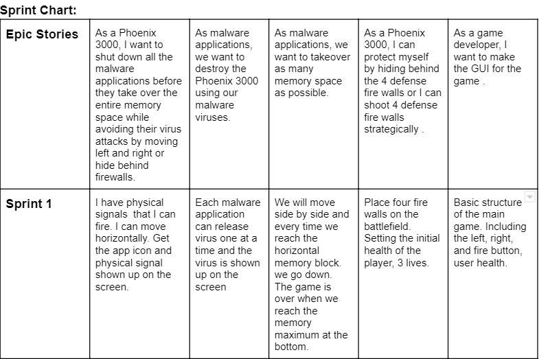
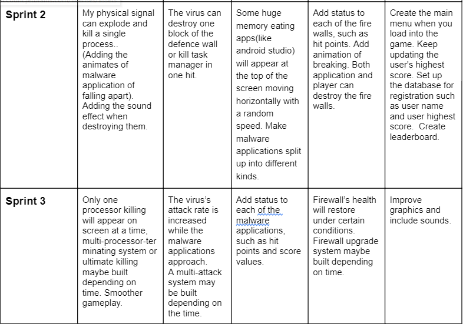

### BHAG:
Evil Russian hacker Dr.Y, designed cracked versions of many popular applications. Some poor kids downloaded those applications from his website. 
His malware applications carries numbers of lethal viruses and tries to overflow the system memory. Thankgod those kids have installed the powerful
antivirus software, Phoenix 3000. You as a Phoenix 3000 must terminate malware processors using physical signals before they take over the memory. 
Meanwhile, you should be careful from those viruses which will infect the system and terminate Phoenix 3000. 

### Epic Stories:

As a Phoenix 3000, I want to shut down all the malware applications before they take over the memory while avoiding attacks from viruses. 
As a malware application, I may contain some malware viruses which could infect the system and kill the Phoenix 3000.   
As a malware application, I want to takeover the entire memory space, the more depth app reach, more memory will be taken over..  
As a Phoenix 3000, I can protect myself from viruses by hiding behind the 4 defense firewalls.  
As a game developer, I want to make the GUI for the game.  

